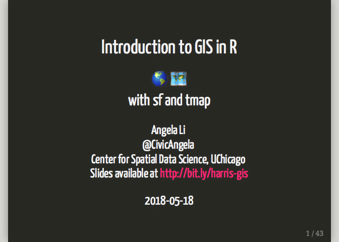

Intro to GIS for R
================
Angela Li
2018-05-18

This talk is a modified version of my [previous talk](https://github.com/angela-li/rladies-spatial-data) for R-Ladies Chicago, with the goal of inspiring UChicago students to go out and try using R for GIS.

I rapidly sailed through a lot of content when I gave the talk, so I'd recommend going back and digging through these slides in depth. You can find the data for the talk in the `data` folder.

Below are the slides from the presentation, which I updated a bit based on feedback I got from y'all. If you have additional comments, please let me know! The shortlink to the slides is [bit.ly/harris-gis](bit.ly/harris-gis) for easy reference.

\*\*Advanced material: If you know how to fork and clone a Github repository, I'd recommend doing that with this repository to get the data quickly. I've extracted all the code out into a R script (using `knitr::purl(gis-R.Rmd)`) that you can simply run once you've forked this repo and cloned it into RStudio on your local device.
